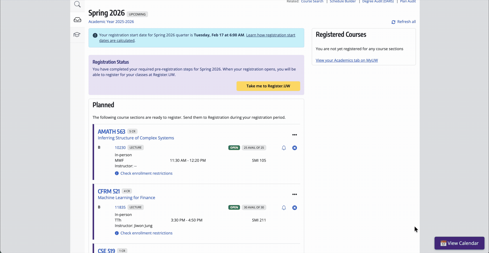

# MyPlan Calendar

Enhance the University of Washington's **MyPlan** tool with a functional and visually integrated **Calendar View**.

This userscript parses your planned courses and displays them in a clean, weekly grid, making it easier to visualize your schedule for future quarters.

## Features
- **Weekly Grid View**: Visual representation of your planned courses.
- **Interactive Popover**: Click any course to see detailed information (SLN, Credits, Location, Instructor, and real-time Availability).
- **Automatic Updates**: Syncs directly with the latest version from GitHub.

## Installation

### 1. Install a Userscript Manager
You need a browser extension to run this script:
- **Chrome/Firefox/Edge**: [Tampermonkey](https://www.tampermonkey.net/) (Recommended) or [Violentmonkey](https://violentmonkey.github.io/)
- **Safari**: [Userscripts](https://itunes.apple.com/us/app/userscripts/id1463298887) (Free and Open Source)
- **Firefox (Android)**: [Tampermonkey](https://www.tampermonkey.net/) or [Greasemonkey](https://www.greasemonkey.net/)

### 2. Install MyPlan Calendar
Choose your preferred platform:

## Usage
1. Log in to [UW MyPlan](https://myplan.uw.edu/plan/).
2. Navigate to a plan page (e.g., `https://myplan.uw.edu/plan/#/sp26`).
3. Click the **"Show Calendar"** button that appears on the page.
4. Click on any course block in the calendar to view full details.
5. Click anywhere on the background to close the calendar view.

## License
Distributed under the [GPL-3.0 License](LICENSE).
